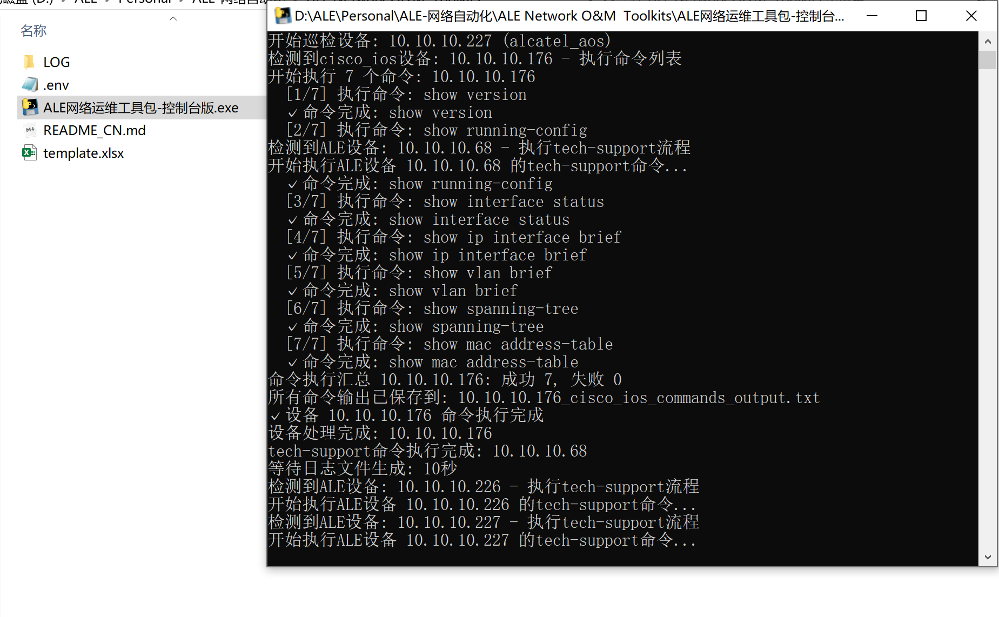

# ALE Network O&M Toolkits

## 🎯 Overview

This is a comprehensive Operations & Maintenance (O&M) toolkit specifically designed for **ALE (Alcatel-Lucent Enterprise)** network devices. The toolkit provides automated device inspection, health monitoring, configuration backup, and comprehensive reporting capabilities for network administrators.

### 🔧 What This Toolkit Does

The ALE Network O&M Toolkits automate the following operations & maintenance tasks:

1. **Device Connectivity Testing** - Automatically connects to multiple network devices via SSH
2. **ALE Device Processing** - For ALE devices: Runs `show tech-support` command and downloads log files
3. **Multi-Vendor Support** - For other vendors: Executes vendor-specific command lists from Excel sheets
4. **Log File Collection** - Downloads critical log files from ALE devices via FTP/TFTP:
   - `tech_support_layer3.log`
   - `tech_support_layer2.log`
   - `tech_support.log`
5. **Command Output Consolidation** - Saves all command outputs for non-ALE devices in unified text files
6. **Individual Device Packaging** - Creates separate ZIP packages for each device
7. **Comprehensive Reporting** - Generates summary packages and detailed email reports
8. **Email Notifications** - Sends automated email reports with all device packages as attachments

### 🎯 Purpose & Benefits

- **Automated Network O&M**: Eliminate manual device inspection and maintenance tasks
- **Multi-Vendor Support**: Handle ALE devices and other vendors (Cisco, Huawei, H3C, etc.) differently
- **Centralized Log Collection**: Gather critical system logs from multiple devices
- **Individual Device Packaging**: Each device gets its own compressed package for easy management
- **Vendor-Specific Processing**: ALE devices use tech-support workflow, others use command lists
- **Comprehensive Reporting**: Generate detailed reports with vendor identification
- **Operational Efficiency**: Reduce hours of manual O&M work to minutes of automated execution

### 📸 Toolkit Demonstration


*The toolkit interface showing automated O&M process and results*

### 🔄 Workflow Overview

```
Excel Configuration → Device Connection → Tech-Support Execution → Log Download → Result Compression → Email Report
       ↓                    ↓                     ↓                    ↓                ↓               ↓
   template.xlsx      SSH to devices      show tech-support      FTP/TFTP files    ZIP creation    SMTP delivery
```

**Typical Execution Flow:**
1. 📋 Read device list from Excel with vendor-specific command sheets
2. 🔌 Establish SSH connections to all devices
3. 🔀 **Device Type Processing:**
   - **ALE Devices**: Execute tech-support → Download log files via FTP/TFTP
   - **Other Vendors**: Execute command list → Save outputs to unified file
4. 📦 Create individual ZIP package for each device
5. 📊 Generate summary package with all device packages
6. 📧 Email all packages to administrators with vendor identification

## 🚀 Quick Start

### Step 1: Install Dependencies
```bash
pip install -r requirements.txt
```

### Step 2: Configure Device List
```
1. Open template.xlsx
2. Fill in device information
3. Save the file
```

### Step 3: Configure Email Settings (Optional)
```
1. Edit .env file
2. Set SMTP server and credentials
3. Configure sender/receiver emails
```

### Step 4: Run O&M Toolkit
```bash
python ale_inspection.py
```

## 📋 Prerequisites

### ⚠️ Important: Configure Device List First
Before running the O&M toolkit, **you must configure the device list in the Excel file**:

1. **Open Configuration File**: `template.xlsx`
2. **Configure Device Information**: Fill in device details in the "Device Information" worksheet
3. **Check Command Configuration**: Verify the command worksheet for corresponding device types
4. **Save File**: Ensure the configuration is saved

## 📋 O&M Process

### ALE Device Workflow
1. **Device Detection** - Identify devices with `alcatel_aos` type
2. **Tech-Support Execution** - Run `show tech-support` command
3. **Log File Download** - Download via FTP (primary) or TFTP (fallback):
   - `tech_support_layer3.log`
   - `tech_support_layer2.log`
   - `tech_support.log`
4. **Individual Packaging** - Create device-specific ZIP package

### Other Vendor Workflow
1. **Vendor Detection** - Identify Cisco, Huawei, H3C, Ruijie, etc.
2. **Command Execution** - Run commands from vendor-specific Excel sheet
3. **Output Consolidation** - Save all command outputs in single text file
4. **Individual Packaging** - Create device-specific ZIP package

### Final Processing
1. **Summary Package** - Combine all device packages
2. **Email Delivery** - Send packages with vendor identification

## 📁 Core Files

```
├── ale_inspection.py          # Main O&M program (interactive startup)
├── connect.py                 # Device connection module
├── send_email.py              # Email sending module
├── zip_file.py                # File compression module
├── env_loader.py              # Environment variable loader
├── tftp_downloader.py         # TFTP download tool
├── template.xlsx              # Device configuration file
├── .env                       # Email configuration file
└── LOG/                       # O&M results directory
```

## ⚙️ Excel Configuration

Configure device information in `template.xlsx`:

| No. | Status | Device IP | Protocol | Port | Username | Password | Enable Password | Device Type |
|-----|--------|-----------|----------|------|----------|----------|-----------------|-------------|
| 1 | Enable | 10.10.10.226 | ssh | 22 | admin | switch | | alcatel_aos |
| 2 | Enable | 192.168.1.100 | ssh | 22 | admin | cisco123 | | cisco_ios |
| 3 | Enable | 192.168.1.101 | ssh | 22 | admin | huawei123 | | huawei |

**Important Notes:**
- Use `alcatel_aos` for ALE device type (tech-support workflow)
- Use vendor-specific types for other devices (command list workflow):
  - `cisco_ios`, `cisco_xe`, `cisco_nxos` for Cisco devices
  - `huawei`, `huawei_vrp` for Huawei devices
  - `h3c_comware` for H3C devices
  - `ruijie_os` for Ruijie devices
- Fill `#` in Status column to skip the device
- Each device type should have corresponding command sheet in Excel

## 📧 Email Configuration

Email parameters are configured in `.env` file:
- Sender: (configure in .env)
- Receiver: (configure in .env)
- SMTP Server: (configure in .env)

## 🔧 Usage

### Interactive Mode
```bash
python ale_inspection.py
```
The program will automatically:
1. **Read Excel configuration** - Load device list and vendor-specific commands
2. **Connect to all devices** - Establish SSH connections
3. **Process by device type**:
   - **ALE devices**: Execute tech-support → Download logs → Package individually
   - **Other vendors**: Execute command list → Consolidate outputs → Package individually
4. **Create summary package** - Combine all device packages
5. **Send email notification** - Deliver packages with vendor identification

## 📊 Output Results

```
LOG/
├── 10.10.10.226_2025-07-16_14-30-15/          # ALE Device Directory
│   ├── 10.10.10.226_tech_support_layer3.log   # Downloaded log files
│   ├── 10.10.10.226_tech_support_layer2.log
│   └── 10.10.10.226_tech_support.log
├── 192.168.1.100_2025-07-16_14-30-15/         # Cisco Device Directory
│   └── 192.168.1.100_cisco_ios_commands_output.txt  # Consolidated commands
├── 192.168.1.101_2025-07-16_14-30-15/         # Huawei Device Directory
│   └── 192.168.1.101_huawei_commands_output.txt     # Consolidated commands
├── 10.10.10.226_2025-07-16_14-30-15.zip       # Individual device packages
├── 192.168.1.100_2025-07-16_14-30-15.zip
├── 192.168.1.101_2025-07-16_14-30-15.zip
└── all_devices_2025-07-16_14-30-15.zip        # Summary package
```

## ⚠️ Important Notes

1. **Individual Packaging**: Each device gets its own ZIP package for easy management
2. **Vendor Identification**: Email reports clearly identify device vendors (ALE, Cisco, Huawei, etc.)
3. **FTP Download**: If FTP download fails for ALE devices, fallback records are created
4. **Command Consolidation**: Non-ALE devices have all command outputs in single text file
5. **Email Delivery**: Multiple packages sent as attachments with size optimization

## 🆘 Troubleshooting

### Connection Failed
- Check device IP and authentication information
- Verify network connectivity

### File Download Failed (ALE Devices)
- Check device FTP service is enabled
- Verify FTP port 21 is accessible
- Confirm file permissions and file existence
- Check username/password for FTP access
- Verify tech-support logs are generated in root directory

### Command Execution Failed (Other Vendors)
- Verify device type matches Excel sheet name
- Check command syntax in vendor-specific sheet
- Confirm device supports the configured commands
- Verify user privileges for command execution

### Email Sending Failed
- Check email configuration in .env file
- Verify network connection

## 🛠️ Installation

### Requirements
```bash
pip install -r requirements.txt
```

### Dependencies
- netmiko>=4.0.0
- paramiko>=2.7.0
- openpyxl>=3.0.0
- pandas>=1.3.0

## 📚 Documentation

- [中文文档](README_CN.md) - Chinese Documentation
- [English Documentation](README.md) - This file

## 🔧 Features

- ✅ **Multi-vendor Support**: ALE devices (tech-support) + Other vendors (command lists)
- ✅ **Excel Configuration**: Device management with vendor-specific command sheets
- ✅ **Differential Processing**: ALE vs non-ALE devices handled differently
- ✅ **Individual Packaging**: Each device gets its own ZIP package
- ✅ **Vendor Identification**: Clear vendor labeling in CLI and email reports
- ✅ **FTP Primary Download**: FTP-first approach for ALE log file downloads
- ✅ **Command Consolidation**: Single file output for non-ALE device commands
- ✅ **Email Optimization**: Smart attachment size management
- ✅ **Comprehensive Logging**: Detailed error handling and progress tracking
- ✅ **Console Interface**: Command-line interface for automated operations

## 📦 Windows Packaged Version

This project provides Windows executable version that runs without Python installation.

### 🚀 Release Version Demo



### 📥 How to Get

1. Visit the project [Releases](../../releases) page
2. Download the latest Windows packaged file
3. Extract and configure `template.xlsx` and `.env` files
4. Double-click `ALE网络运维工具包.exe` to run

### 💡 Packaged Version Features

- ✅ **No Installation Required** - No Python environment needed
- ✅ **Standalone Execution** - Contains all necessary libraries
- ✅ **Simple Configuration** - Only configuration files needed
- ✅ **Good Compatibility** - Supports Windows 7 and above

## 📝 License

This project is licensed under the MIT License.

---

**Usage Recommendations**:
- Development: Run `python ale_inspection.py` directly
- Production: Use Windows packaged version from Releases

**Ready to automate your network operations!** 🚀
