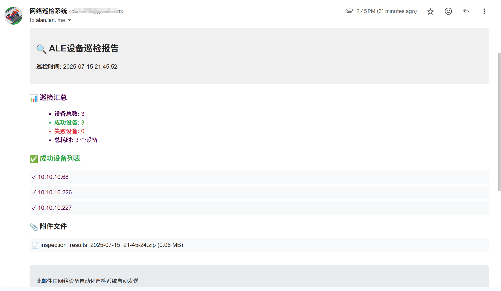

# ALE网络运维工具包 (中文版)

## 🎯 系统概述

这是一个专门为 **ALE (Alcatel-Lucent Enterprise)** 网络设备设计的综合运维工具包。工具包提供自动化设备巡检、健康监控、配置备份和全面的报告功能，为网络管理员提供完整的运维解决方案。

### 🔧 工具包功能

ALE网络运维工具包自动化执行以下运维任务：

1. **设备连接测试** - 通过SSH自动连接多台网络设备
2. **ALE设备处理** - 对ALE设备：运行 `show tech-support` 命令并下载日志文件
3. **多厂商支持** - 对其他厂商：执行Excel表中的厂商专用命令列表
4. **日志文件收集** - 通过FTP/TFTP从ALE设备下载关键日志文件：
   - `tech_support_layer3.log`
   - `tech_support_layer2.log`
   - `tech_support.log`
5. **命令输出整合** - 将非ALE设备的所有命令输出保存到统一文本文件
6. **单设备打包** - 为每个设备创建独立的ZIP压缩包
7. **综合报告** - 生成汇总包和详细邮件报告
8. **邮件通知** - 发送包含所有设备包的自动化邮件报告

### 🎯 目的与优势

- **自动化网络运维**: 消除手动设备巡检和维护任务
- **多厂商支持**: 区别处理ALE设备和其他厂商（思科、华为、H3C等）
- **集中日志收集**: 从多台设备收集关键系统日志
- **单设备打包**: 每个设备获得独立的压缩包，便于管理
- **厂商专用处理**: ALE设备使用tech-support流程，其他设备使用命令列表
- **综合报告**: 生成带厂商标识的详细报告
- **运维效率**: 将数小时的手动运维工作减少到几分钟的自动化执行

### 📸 工具包演示



*工具包界面显示自动化运维过程和结果*

### 🔄 工作流程概览

```
Excel配置 → 设备连接 → Tech-Support执行 → 日志下载 → 结果压缩 → 邮件报告
    ↓         ↓           ↓              ↓         ↓         ↓
template.xlsx SSH连接  show tech-support FTP/TFTP文件 ZIP创建  SMTP发送
```

**典型运维流程:**
1. 📋 从Excel读取设备列表和厂商专用命令表
2. 🔌 建立SSH连接到所有设备
3. 🔀 **设备类型处理:**
   - **ALE设备**: 执行tech-support → 通过FTP/TFTP下载日志文件
   - **其他厂商**: 执行命令列表 → 保存输出到统一文件
4. 📦 为每个设备创建独立ZIP包
5. � 生成包含所有设备包的汇总包
6. 📧 将所有包邮件发送给管理员，带厂商标识

## 🚀 快速开始

### 第一步：配置设备清单
```
1. 打开 template.xlsx
2. 填写设备信息
3. 保存文件
```

### 第二步：运行巡检程序
```bash
python ale_inspection.py
```

## 📋 巡检流程

1. **读取Excel设备清单** - 从template.xlsx读取设备配置
2. **ALE设备特殊处理** - 执行`show tech-support`命令
3. **TFTP文件传输** - 下载根目录的三个日志文件
4. **文件命名规范** - 保存的日志文件名包含设备IP
5. **完成后处理** - 压缩LOG文件夹并发送邮件

## 📁 核心文件

```
├── ale_inspection.py          # 主程序（交互式启动）
├── connect.py                 # 设备连接模块
├── send_email.py              # 邮件发送模块
├── zip_file.py                # 文件压缩模块
├── env_loader.py              # 环境变量加载器
├── tftp_downloader.py         # TFTP下载工具
├── template.xlsx              # 设备配置文件
├── .env                       # 邮件配置文件
└── LOG/                       # 巡检结果目录
```

## ⚙️ Excel配置

在 `template.xlsx` 中配置设备信息：

| 序号 | 状态 | 设备IP | 协议 | 端口 | 用户名 | 密码 | 特权密码 | 设备类型 |
|------|------|--------|------|------|--------|------|----------|----------|
| 1 | 启用 | 10.10.10.226 | ssh | 22 | admin | switch | | alcatel_aos |

**重要说明：**
- ALE设备的设备类型使用：`alcatel_aos`
- 状态列填写`#`可跳过该设备

## 📧 邮件配置

邮件参数在 `.env` 文件中配置：
- 发送者：
- 接收者：
- SMTP服务器：

## 🔧 使用方法

### 交互式模式
```bash
python ale_inspection.py
```
程序会自动：
1. 读取Excel配置
2. 连接ALE设备
3. 执行tech-support命令
4. 尝试下载日志文件
5. 执行其他巡检命令
6. 压缩结果文件
7. 发送邮件通知

## 📊 输出结果

```
LOG/
├── 10.10.10.226_2025-07-16_14-30-15/          # ALE设备目录
│   ├── 10.10.10.226_tech_support_layer3.log   # 下载的日志文件
│   ├── 10.10.10.226_tech_support_layer2.log
│   └── 10.10.10.226_tech_support.log
├── 192.168.1.100_2025-07-16_14-30-15/         # 思科设备目录
│   └── 192.168.1.100_cisco_ios_commands_output.txt  # 整合的命令输出
├── 192.168.1.101_2025-07-16_14-30-15/         # 华为设备目录
│   └── 192.168.1.101_huawei_commands_output.txt     # 整合的命令输出
├── 10.10.10.226_2025-07-16_14-30-15.zip       # 单设备压缩包
├── 192.168.1.100_2025-07-16_14-30-15.zip
├── 192.168.1.101_2025-07-16_14-30-15.zip
└── all_devices_2025-07-16_14-30-15.zip        # 汇总压缩包
```

## ⚠️ 注意事项

1. **单设备打包**: 每个设备获得独立的ZIP包，便于管理
2. **厂商标识**: 邮件报告清楚标识设备厂商（ALE、思科、华为等）
3. **FTP下载**: ALE设备FTP下载失败时会创建备用记录
4. **命令整合**: 非ALE设备的所有命令输出保存在单个文本文件中
5. **邮件发送**: 多个包作为附件发送，带大小优化

## 🆘 故障排除

### 连接失败
- 检查设备IP和认证信息
- 确认网络连通性

### 文件下载失败
- 检查设备TFTP/SCP服务
- 确认文件权限

### 邮件发送失败
- 检查.env文件中的邮件配置
- 确认网络连接

---

## 📦 Windows打包版本

本项目提供Windows可执行文件版本，无需安装Python环境即可直接运行。

### 🚀 Release版本演示


### 📥 获取方式

1. 访问项目的 [Releases](../../releases) 页面
2. 下载最新版本的Windows打包文件
3. 解压后配置 `template.xlsx` 和 `.env` 文件
4. 双击 `ALE网络运维工具包.exe` 运行

### 💡 打包版本特点

- ✅ **免安装** - 无需Python环境
- ✅ **独立运行** - 包含所有必要库
- ✅ **配置简单** - 只需配置文件即可使用
- ✅ **兼容性好** - 支持Windows 7及以上版本

---

**使用建议**:
- 开发环境：直接运行 `python ale_inspection.py`
- 生产环境：使用Release中的Windows打包版本
